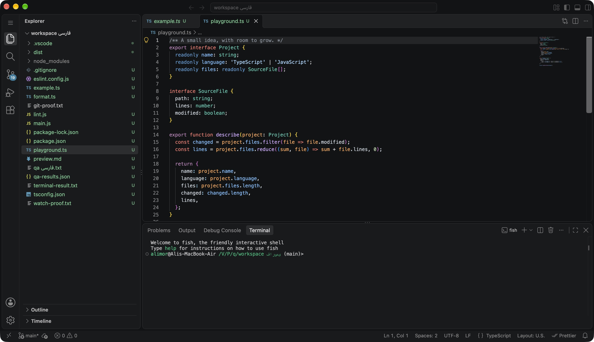

# Paradise Code

A local, open-source editor for Apple Silicon Macs. The real Code – OSS workbench, a Tauri 2 / Rust shell, and a bundled Node.js extension host. Built by [Paradise Code](https://paradisecode.ir).

[Website](https://ide.paradisecode.ir) · [Download for Apple Silicon](https://github.com/alimortazavi-pr/paradise-code/releases/latest/download/Paradise-Code-macos-arm64.zip) · [Releases](https://github.com/alimortazavi-pr/paradise-code/releases) · [Measured results](validation/REPORT.md)



## Install

Download the ZIP, verify its accompanying SHA-256 checksum, extract it, and move **Paradise Code.app** to a writable folder such as Applications. Node and npm are included. macOS 14+ is configured; testing currently covers Apple Silicon on macOS 27. This preview is ad-hoc signed, **not Apple notarized**. If macOS blocks the app, use **System Settings → Privacy & Security → Open Anyway** after verifying the source.

**Paradise Code → Check for Updates…** downloads a signed update from this repository. The application verifies its signature and version before installation, asks you to save your work, and restarts. No GitHub credentials are stored in the application. Versions before 0.2.0 require one manual upgrade.

## The editor

- Integrated Mac title bar, native file/folder/save dialogs, familiar shortcuts, multiple windows, and Finder file opening.
- Explorer, tabs, split editors, search/replace, Git and diffs, real terminals, Tasks, Node debugging, web language IntelliSense, themes, and settings.
- Open VSX and local VSIX installation. ESLint, Prettier, JavaScript, TypeScript, and Persian text are acceptance paths.
- Local operation with installed tools and dependencies. Unsaved-work recovery and separate settings from VS Code.

This is a **public preview**. The memory-performance target has **not been met**. It must not be described as lower-RAM, fully compatible with Microsoft VS Code, or production certified. Microsoft Marketplace, proprietary Microsoft services, Copilot, cloud sync, SSH, and Containers are not included. See [validation](validation/REPORT.md) for actual results and limitations.

## Storage

On a new Mac, user data lives in `~/Library/Application Support/ParadiseCodeData`. Existing external-SSD installations keep their original profile and require that drive; a missing drive never silently creates an internal replacement. A small preferences file remembers the storage location. VS Code settings are not imported automatically.

The project’s build environment is entirely on `/Volumes/ParadiseCodeBuild`, an APFS sparsebundle stored on the external SSD. Source, dependencies, caches, profiles, temporary files and artifacts remain there. `scripts/env.sh` fails if the volume is absent. System-managed swap and caches are outside application control.

## Build

Install Xcode Command Line Tools and Rust. Create and mount an APFS sparsebundle on the external SSD without repartitioning it, then clone here:

```sh
git clone git@github.com:alimortazavi-pr/paradise-code.git /Volumes/ParadiseCodeBuild/project
cd /Volumes/ParadiseCodeBuild/project
bash scripts/bootstrap.sh
```

`upstream.json` pins Code – OSS 1.140.0 and its source commit. Build Node follows upstream’s `.nvmrc`; the packaged runtime follows the upstream remote build. `scripts/prepare-upstream.py` generates the tracked integration patch. Packaging requires a private Tauri updater signing key at `$PARADISE_VOLUME/secrets/updater.key` or `TAURI_SIGNING_PRIVATE_KEY`; use your own key and public-key configuration for a fork. Private keys are never committed.

The packaged product's `commit` field is a content-derived asset/protocol revision so patched builds cannot reuse incompatible web caches. The original source commit remains in `upstream.json` and the packaged `paradiseUpstreamCommit` field.

`scripts/prepare-release.py` prepares the ZIP, checksum, updater archive, signature and versioned `latest.json` after packaging. The static `website/` directory deploys to Vercel. Release metadata is updated only after assets are published.

## Security and verification

Node binds to loopback with a random per-launch token. HTTP Host/Origin and WebSocket Origin are checked. Extension webviews use separate hashed localhost origins. No Tauri IPC permissions are granted to web content; the limited native bridge is available only in the trusted top-level workbench. Extensions still execute local code with your user permissions.

```sh
source scripts/env.sh
cargo check
PARADISE_PROFILE=/path/to/running/test/profile node --test tests/*.test.mjs
```

The development-only `tests/qa-extension` exercises file editing, TypeScript, Git commits, terminals, Tasks, breakpoints, format/lint, and isolated webviews in a disposable fixture. It is never bundled. `scripts/benchmark-run.py` compares the same project and extensions with VS Code; coalition measurements include WebKit helpers. Test evidence and remaining risks live in `validation/`.

The shell and integration are MIT licensed. Code – OSS and bundled components retain their upstream licenses.
